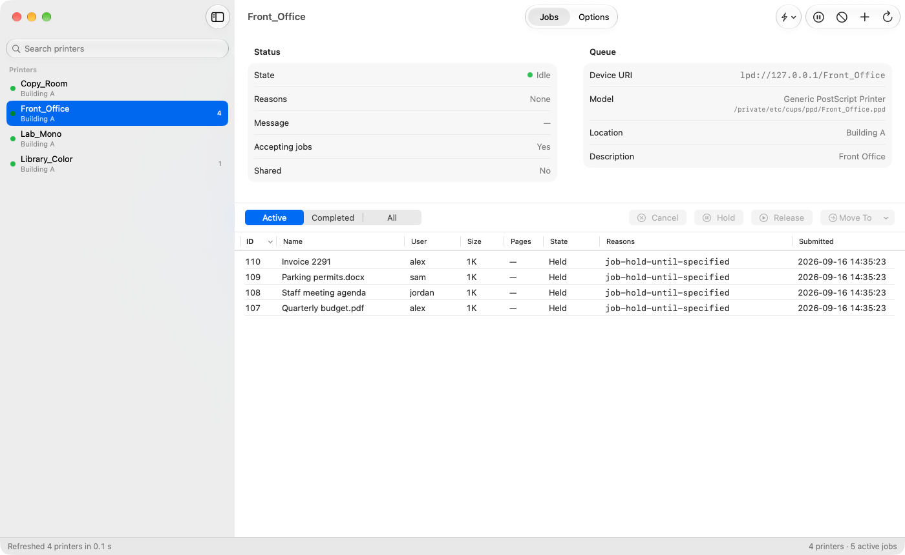
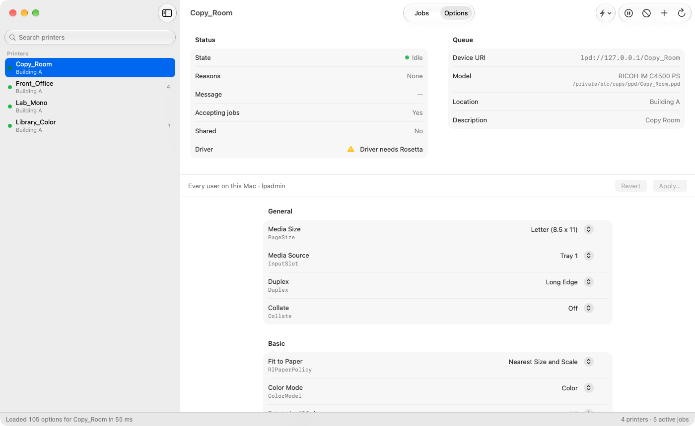

# CUPS Admin for macOS


*Jobs: hold, release, move or cancel jobs on any queue.*


*Options: the queue's driver settings as a form, applied with `lpadmin` and read back.*

**CUPS Admin** is a native macOS app that puts back the CUPS web interface (`http://localhost:631`) Apple removed in macOS 27 — `cupsd`, `lpadmin` and IPP Everywhere queues all still work, only the browser admin page is gone. The sidebar lists every queue with its state and active jobs; select one to see its status, hold, release, move or cancel its jobs, and change its default options the way the old "Set Default Options" page did, including per-driver settings like Ricoh user codes. Common changes (color or black & white, duplex, Letter paper, a user code, the default printer) are one-click Quick Actions, and every change is read back from cupsd so nothing fails silently. It ships with `cupsadmin`, a command-line tool for scripts, Mosyle/Jamf/Munki commands and quick checks. No third-party dependencies; builds with the Xcode Command Line Tools alone.

## Install

> Status: The CLI and app are both usable today; the app doesn't yet cover every page of the old web interface.

Download the signed, notarized PKG from the latest [release](../../releases). It installs:

- `/usr/local/bin/cupsadmin`
- `/Applications/CUPS Admin.app`

The app is a normal payload install with a receipt (`pkgutil --files edu.wku.cupsadmin`). The CLI is installed by a postinstall script instead, so the package never changes the ownership of an existing `/usr/local/bin` (Homebrew on Intel Macs is safe). For Munki, only the CLI needs an `installs` array entry, pointing at `/usr/local/bin/cupsadmin`; the app is covered by the receipt.

Requires macOS 14 or later. Universal (Apple silicon and Intel).

## CLI

```
cupsadmin printers               # every queue: state, reasons, accepting, shared, URI
cupsadmin printers --rosetta     # only queues whose driver filters are Intel-only or missing
cupsadmin printer <queue>        # one queue in detail (--all for every IPP attribute)
cupsadmin jobs [queue]           # active jobs (--completed, --all-jobs)
cupsadmin cancel <job-id>        # cancel one job
cupsadmin options <queue>        # PPD options and IPP *-default values, like lpoptions -l
cupsadmin add <queue> -v <uri> [-m everywhere | -P file.ppd] [-D desc] [-L location] [--shared] [-o k=v ...]
cupsadmin set <queue> -o k=v ... # change queue defaults, then read them back and report
cupsadmin quick <action> <queue> [value]   # task-named shortcuts, see below
cupsadmin ppdreport <queue>      # every PPD group and option: keyword, label, type, default, choices
```

Every run prints `started HH:MM:SS`, one status line (`OK: …` or `ERROR: …`) and `finished HH:MM:SS (total N min)` — on every exit path. Status lines go to stderr so table output pipes cleanly.

`set` is stricter than `lpadmin`: `lpadmin -o PageSzie=Letter` (misspelled) exits 0 and changes nothing; `cupsadmin set` reads the queue back afterwards and reports `NOT APPLIED` with a non-zero exit.

### Quick actions

The things admins actually do, without knowing the driver's option keywords:

```
cupsadmin quick color <queue>          # always print in color
cupsadmin quick bw <queue>             # always print black & white
cupsadmin quick usercode <queue> 12345 # set a Ricoh user code (enables it too)
cupsadmin quick duplex <queue>         # default to two-sided
cupsadmin quick simplex <queue>
cupsadmin quick letter <queue>         # Letter paper + fit to nearest size (no "prompt user" at the printer)
cupsadmin quick default <queue>        # make this the server default printer
```

Which keywords an action writes comes from a driver profile (`Sources/CupsKit/Resources/driver-profiles.json`), matched on the PPD's manufacturer and model. If no profile maps an action for a queue's driver, the action is refused with a message saying why. Because these are ordinary `lpadmin -p <queue> -o …` writes, they work in an MDM custom command exactly as they do in Terminal.

### Supported drivers

| Driver | Quick actions |
|---|---|
| Ricoh PostScript (IM C2000/C4500, MP C2004ex/C3004ex/C307/C3504) | ✓ all |
| Ricoh MP 5055 PS (mono) | ✓ all except color / black & white |
| Ricoh M C251FW PS | ✓ color, black & white, duplex, Letter (no user code) |
| Ricoh PCL (e.g. SP 3710DN) | ✓ duplex, Letter (generic) |
| Any other PPD, IPP Everywhere / AirPrint | ✓ color, black & white, duplex, Letter where the queue supports them (generic) |
| Canon, HP, Xerox, Konica Minolta user/department codes | no built-in profile — add one (below) |

### Adding your printer's driver

1. `cupsadmin ppdreport <queue>` lists every option your driver has; find the color, duplex, paper and accounting/user-code keywords and their choice values.
2. Copy the `ricoh` entry in `Sources/CupsKit/Resources/driver-profiles.json`, give it an `id`, and set `match` to regular expressions for your PPD's `Manufacturer` and `NickName` (both are printed at the top of the report).
3. Replace the `keyword=value` pairs. `{value}` is the code the user types; typed options take `Custom.{value}`. Leave out actions your driver can't do. Keep your profile above `generic`.
4. `swift build && .build/debug/cupsadmin ppdreport <queue>` shows which quick actions are now available; try one with `cupsadmin quick`, then open a pull request.

## How it works

- **Reads** go straight to cupsd over IPP, using a small hand-written IPP encoder/decoder (RFC 8010). That's the same data the web UI showed, fully typed — `printer-state-reasons`, `media-supported`, `*-default`, job state and owner — instead of parsing localized `lpstat` output.
- **Transport is the Unix socket** `/private/var/run/cupsd`, not TCP 631. On macOS 27, launchd socket-activates cupsd only on that socket, and cupsd exits after about a minute idle, so port 631 is only reachable right after something else has woken it. The socket path works cold.
- **Writes** shell out to `lpadmin`, `cupsenable`/`cupsdisable`, `cupsaccept`/`cupsreject`, `lp`, `lpmove` and `cupsctl`, then read the result back over IPP. Admin operations over raw IPP would need the same `_lpadmin` group membership anyway, and `lpadmin` already knows how to generate IPP Everywhere PPDs.
- **Options** are parsed from the queue's PPD, grouped the way the PPD groups them, with typed custom values (user codes, passcodes, numbers) handled as text and number fields. Ricoh's PS drivers are documented in `docs/ricoh-ppd-options.md`.

## Build from source

Requirements: macOS 14+, Xcode Command Line Tools (full Xcode not needed).

```
git clone https://github.com/kfattic/cupsadmin.git
cd cupsadmin
swift build
.build/debug/cupsadmin printers
```

To produce a signed, notarized package like the ones in Releases:

```
export CODESIGN_APP_IDENTITY="<SHA-1 of your Developer ID Application cert>"
export CODESIGN_PKG_IDENTITY="<SHA-1 of your Developer ID Installer cert>"
export NOTARY_PROFILE="<name from: xcrun notarytool store-credentials>"
VERSION=1.2.3 ./build.sh
```

Or put those three lines (without `export`) in a `build.env` next to `build.sh`; it's read if present and gitignored. Variables already set in the environment win.

`build.sh` builds a universal binary (per-architecture `swift build` + `lipo`), signs the CLI and app with the hardened runtime, notarizes and staples the app, builds the PKG (app as payload, CLI via postinstall), notarizes and staples it, and verifies both with `spctl`. Building the PKG asks for admin rights once, to give the staged `Applications` folder the system's root:admin ownership. Use `./build.sh --build-only` to skip signing and notarization. `./build.sh --screenshots` regenerates the README screenshot from three temporary demo queues. Run `./test.sh` for the test suite (`CUPSKIT_LIVE_QUEUE=<throwaway queue>` enables the live tests; `CUPSKIT_LIVE_JOBS` and `CUPSKIT_LIVE_QUICK` take two throwaway queues each for the job and quick-action tests).

## Notes for admins

- Queue defaults written by `set`, `quick` and the app's Options page go into `/etc/cups/ppd/<queue>.ppd` via `lpadmin`, so they apply to every user on the Mac — the same thing the web UI's "Set Default Options" did. Per-user `~/.cups/lpoptions` overrides still win for that user's own jobs.
- PPD files are world-readable. A locked-print password or login password set as a queue default is stored in plain text; the tool warns before doing that. User codes are accounting codes, not secrets.
- New queues default to `printer-is-shared=false`. `lpadmin` defaults to shared; this tool doesn't.
- Driver filters named in a queue's PPD (`*cupsFilter`, `*cupsFilter2`) are checked for an arm64 slice. Queues whose filters are Intel-only show "Driver needs Rosetta" in the app's header and sidebar tooltip and a `WARNING` line in `cupsadmin printer` and `ppdreport`; filters that don't exist show "Driver filter missing". `cupsadmin printers --rosetta` lists the affected queues, for fleet reporting.

## About

Built at Western Kentucky University by Kurt Fattic to replace the CUPS admin pages for a fleet of about 1,000 Macs, and written with Claude. MIT licensed — see `LICENSE`. Not affiliated with Apple or OpenPrinting.

Bug reports and driver profiles for other printers are welcome through [Issues](../../issues) and [Pull Requests](../../pulls).
